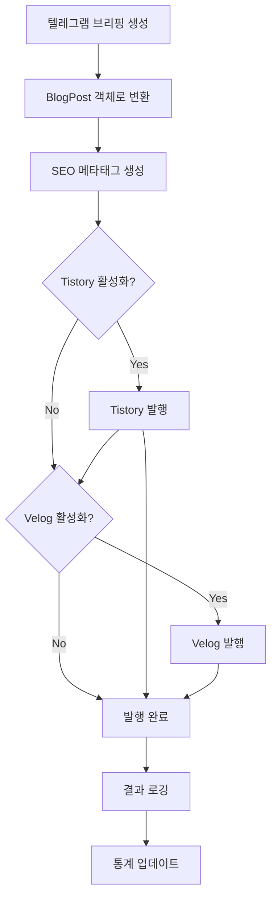

# Blog Publishing System

자동 블로그 포스팅 시스템입니다. Tistory와 Velog에 매일 금융 브리핑을 자동으로 발행합니다.

## 📋 Features

- ✅ **Tistory API 통합** - OAuth 인증 및 포스트 자동 발행
- ✅ **Velog GraphQL API 통합** - 마크다운 변환 및 시리즈 관리
- ✅ **SEO 최적화** - Open Graph, Twitter Card, Schema.org JSON-LD
- ✅ **자동 스케줄링** - Cron을 활용한 일일 자동 발행
- ✅ **콘텐츠 변환** - 텔레그램 브리핑을 블로그 형식으로 자동 변환
- ✅ **재시도 로직** - 실패 시 자동 재시도
- ✅ **발행 이력 추적** - 통계 및 성공률 모니터링

## 🚀 Quick Start

### 1. 환경변수 설정

`.env` 파일에 다음 내용을 추가하세요:

```bash
# Blog Scheduler
ENABLE_SCHEDULER=false
BLOG_PUBLISH_TIME=0 8 * * *
RUN_ONCE=false

# Tistory Configuration
ENABLE_TISTORY=true
TISTORY_CLIENT_ID=your_client_id
TISTORY_CLIENT_SECRET=your_client_secret
TISTORY_BLOG_NAME=your_blog_name
TISTORY_ACCESS_TOKEN=your_access_token

# Velog Configuration (Optional)
ENABLE_VELOG=true
VELOG_ACCESS_TOKEN=your_velog_token
VELOG_USERNAME=your_username

# Site Configuration
SITE_URL=https://finbrief.io
TELEGRAM_LINK=https://t.me/finbrief_bot
```

### 2. Tistory API 설정

1. [Tistory 오픈 API](https://www.tistory.com/guide/api/manage/register) 접속
2. 앱 등록 (Client ID, Client Secret 발급)
3. OAuth 인증으로 Access Token 획득
4. 블로그 이름 확인 (예: `myblog.tistory.com`의 경우 `myblog`)

### 3. Velog Token 획득 (선택사항)

1. Velog에 로그인
2. 개발자 도구 (F12) 열기
3. Application → Cookies → `access_token` 복사
4. `.env`에 추가

### 4. 테스트 실행

```bash
# 인증 테스트
npm run test:blog

# 한 번만 포스팅 (테스트용)
npm run publish:blog
```

## 📝 사용 방법

### 자동 스케줄링

매일 정해진 시간에 자동으로 포스팅:

```bash
# .env 파일에서 설정
ENABLE_SCHEDULER=true
BLOG_PUBLISH_TIME=0 8 * * *  # 매일 오전 8시

# 실행
npm run test:blog
```

### 수동 발행

원하는 시점에 수동으로 포스팅:

```bash
RUN_ONCE=true npm run publish:blog
```

### 프로그래밍 방식으로 사용

```typescript
import { BlogScheduler } from './schedulers/blog-scheduler';

const scheduler = new BlogScheduler({
  cronTime: '0 8 * * *',
  enableTistory: true,
  tistory: {
    clientId: process.env.TISTORY_CLIENT_ID!,
    clientSecret: process.env.TISTORY_CLIENT_SECRET!,
    blogName: process.env.TISTORY_BLOG_NAME!,
    accessToken: process.env.TISTORY_ACCESS_TOKEN!,
  },
});

// 테스트
await scheduler.testPublish();

// 한 번 실행
await scheduler.runPublishingPipeline();

// 스케줄링 시작
scheduler.scheduleDaily();
```

## 🏗️ 아키텍처

```
src/
├── publishers/
│   ├── types.ts                  # 공통 타입 정의
│   ├── tistory-publisher.ts      # Tistory API 클라이언트
│   ├── velog-publisher.ts        # Velog GraphQL 클라이언트
│   └── content-transformer.ts    # 콘텐츠 변환기
├── seo/
│   ├── meta-generator.ts         # SEO 메타태그 생성
│   └── schema-generator.ts       # Schema.org JSON-LD
├── schedulers/
│   └── blog-scheduler.ts         # 스케줄러 및 파이프라인
└── blog-publisher-example.ts     # 사용 예제
```

## 📊 발행 파이프라인



## 🔧 주요 클래스

### TistoryPublisher

```typescript
class TistoryPublisher {
  authenticate(): Promise<boolean>
  createPost(post: BlogPost): Promise<PublishResult>
  uploadImage(imageUrl: string): Promise<string | null>
  categorizePost(tags: string[]): string
  createPostWithRetry(post: BlogPost, maxRetries?: number): Promise<PublishResult>
}
```

### VelogPublisher

```typescript
class VelogPublisher {
  authenticate(): Promise<boolean>
  createPost(post: BlogPost): Promise<PublishResult>
  ensureSeries(seriesName: string): Promise<string | null>
  addToSeries(postId: string, seriesId: string): Promise<boolean>
  convertToMarkdown(html: string): string
}
```

### ContentTransformer

```typescript
class ContentTransformer {
  generateTitle(date?: Date): string
  extractSummary(briefing: string): string
  telegramToBlog(briefing: string, options?: TransformOptions): string
  createBlogPost(briefing: string, options?: object): BlogPost
}
```

### BlogScheduler

```typescript
class BlogScheduler {
  scheduleDaily(cronTime?: string): void
  runPublishingPipeline(briefingContent?: string): Promise<PublishingResult>
  testPublish(): Promise<boolean>
  getHistory(limit?: number): PublishingResult[]
  getStats(): object
}
```

## ⚙️ 환경변수 전체 목록

| 변수명 | 필수 | 기본값 | 설명 |
|--------|------|--------|------|
| `ENABLE_SCHEDULER` | No | `false` | 자동 스케줄링 활성화 |
| `BLOG_PUBLISH_TIME` | No | `0 8 * * *` | 발행 시간 (Cron 표현식) |
| `RUN_ONCE` | No | `false` | 한 번만 실행 |
| `ENABLE_TISTORY` | No | `false` | Tistory 발행 활성화 |
| `TISTORY_CLIENT_ID` | Yes* | - | Tistory API Client ID |
| `TISTORY_CLIENT_SECRET` | Yes* | - | Tistory API Client Secret |
| `TISTORY_BLOG_NAME` | Yes* | - | Tistory 블로그 이름 |
| `TISTORY_ACCESS_TOKEN` | Yes* | - | Tistory Access Token |
| `ENABLE_VELOG` | No | `false` | Velog 발행 활성화 |
| `VELOG_ACCESS_TOKEN` | Yes** | - | Velog Access Token |
| `VELOG_USERNAME` | Yes** | - | Velog 사용자명 |
| `SITE_URL` | No | `https://finbrief.io` | 사이트 URL |
| `TELEGRAM_LINK` | No | `https://t.me/finbrief_bot` | 텔레그램 링크 |

\* Tistory 활성화 시 필수  
\** Velog 활성화 시 필수

## 🧪 테스트

```bash
# 전체 테스트 (인증 확인)
npm run test:blog

# 실제 포스팅 테스트 (private으로 발행 후 확인)
# .env에서 visibility를 'private'으로 설정하고
RUN_ONCE=true npm run publish:blog
```

## 🐛 트러블슈팅

### Tistory 인증 실패

- Access Token이 만료되었을 수 있습니다. OAuth 재인증 필요
- Client ID/Secret 확인
- 블로그 이름이 정확한지 확인

### Velog 인증 실패

- Access Token이 만료되었을 수 있습니다. 재로그인 후 토큰 재발급
- Username이 정확한지 확인

### 포스팅은 성공했는데 시리즈에 추가되지 않음

- Velog 시리즈 이름 확인
- GraphQL 권한 문제일 수 있음

## 📝 TODO

- [ ] SQLite DB에 발행 이력 저장
- [ ] 실패 시 텔레그램 알림
- [ ] AI 이미지 생성 (썸네일)
- [ ] Google Search Console에 색인 요청 API
- [ ] 네이버 블로그 통합 (선택사항)

## 📄 License

MIT
